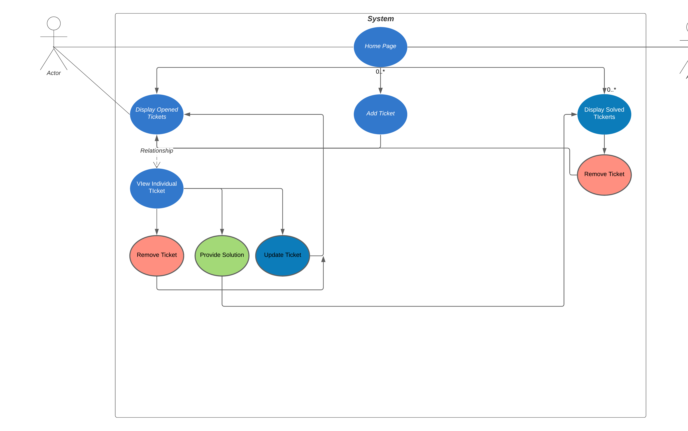
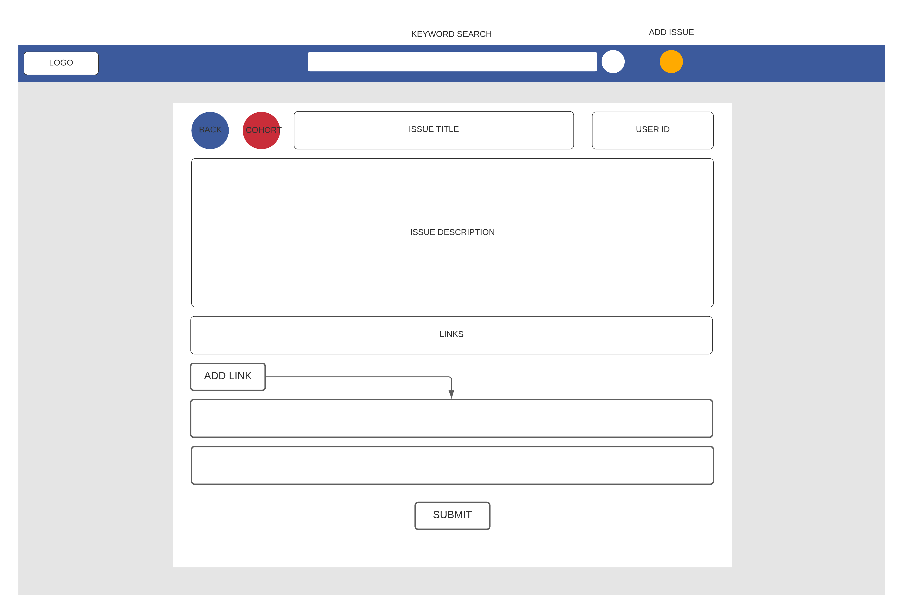
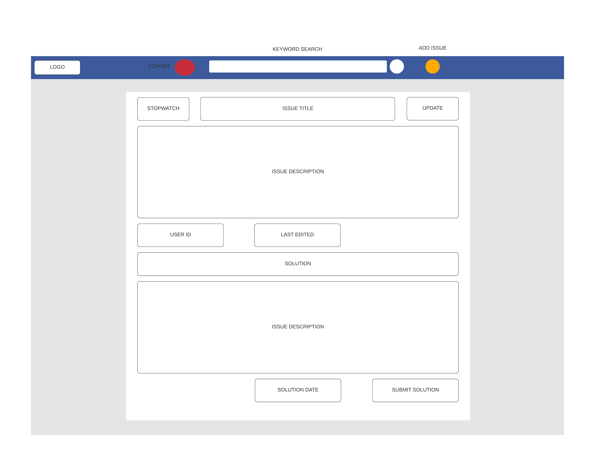

# Final-Project
---
## Overview
The idea for this project is to design an application,
encompassing all the techniques and tools learnt throughout the academy.

The project must be built and design to host a `Help Queue` application,
where users will be able to log issues, entering a queue system. 
The project should include the following features;

### Basic Functionality
Create basic functionality for the application, including full CRUD.
Users will be ab   le to:

* Create new tickets and add them to the queue
* View tickets in the current queue from oldest to newest
* Delete existing tickets in the queue
* Update existing tickets in the queue

### Extra Functionality 

#### Solutions
When a ticket is being marked as "Done", 
users should be able to add a solution 
to that ticket, allowing other users to
see the solutions to a problem that has already been solved.

#### Cohorts
Implement a help queue per cohort, 
such that trainees can navigate to their 
cohort to see the help queue specific to their class.

A cohort page should display the trainers and trainees can make up that cohort.

#### Keyword Search
Implement a search bar feature, so that users can filter tickets based on keywords.

### Technologies

| Technology               | Constraint  |
| -----------              | ----------- |
| Kanban Board             | Jira        |
| Version Control          | Git|
| CI Server                | Jenkins |
| Configuration Management | Ansible |
| Cloud Server             | AWS EC2 |
| Database Server          | AWS RDS |
| Containerisation         | Docker  |
| Reverse Proxy            | NGINX  |
| Orchestration Tool       | Kubernetes  |
| Infrastructure Management| Terraform  |
| Programming language     | Java |
| Front-End                | React |
| Unit Tests               | JUnit and Mockito |
| Integration Test         | Selenium |

## Project Planning
---
### Risk Assessment 
A full risk assessment was carried out before commencing with project tasks. The whole assessment can be found at the following link:
https://docs.google.com/spreadsheets/d/1dbGavZvYB49_sulU9LrpJMsQJbQKQnIY7yc4-30rA4o/edit#gid=0

### User Experience

Below we describe the users experience when using the site, 
this is done in a flowchart diagram, where the user 
can access different pages in a structured environment.

#### Diagram

### Wireframes

#### HOME PAGE

#### ADD TICKET

#### EDIT/ADD SOLUTION

### CI Pipeline

### AWS
#### Network Diagram

### MOSCOW Prioritisation

### Entity Relationship Diagram

### Testing 
#### Backend: Java

#### Frontend: React
The frontend of the application was tested using Jest and the React-render-library. Snapshots were employed on all components providing >70% coverage and ensuring code consistency post deployment. Unit testing was completed on key application fucntionality such as [insert list when done]. A view of the coverage report can be seen below:

### Frontend Design 

### Authors

### Acknowledgements 
